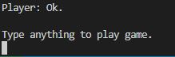
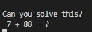
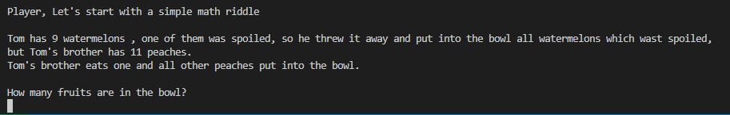
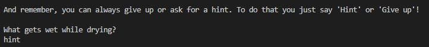
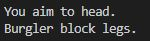
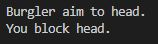
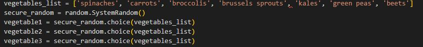
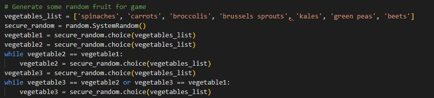

# Interactive story

[View Live Project Here](https://interactivestory.herokuapp.com/)

Interactive story is a Python terminal game.

In this game, players can choose how the story will play out.
In the story, payer can find 4 minigames:
 * Math - Players will be given 4 mathematical assignments.
 * Riddle - Players will be given three random riddles to solve
 * Math riddles - Players will be given 2 mathematical riddles 
 * Fighting - Players can try to win this minigame by reducing the opponent's health points.

## How to play

Playing this game players will be provided with choices of what to do. A player will need to type in his/her choices from the given one.

### Math minigame

To win the Math minigame you will need to solve 4 mathematical assignments by providing correct answer

### Riddle minigame

To win the Riddle minigame you will need to solve 2 riddles by providing correct answer

### Math riddles minigame

To win the Math riddles minigame you will need to solve 2 mathematical riddl assignments by providing correct answer

### Fighting minigame

To win Fighting minigame you will need to reduce computers health points before he do it to you. You will be able to aim your hits to head, body or legs and try to block hits to head, body or legs. And the computer will do the same. To win this game you will need to guest wear a computer will hit and try to block that place. And also try to guest wear computer will block and try to avoid being blocked. More unblocked hits you will make, the quicker will reduce computers health points. More hits you will guest and block the fewer health points you will lose.

## Technology

* Python

## Features

### Existing Features

* Player's name that they will type at the start of the game always will appear with a capital letter, even if they will provide their name without it
  * The name provided at the beginning of the game will appear in the game
* All inputs in all games and mini-games are going through validation and error checks
* Before any game starts you will be asked to type anything. This is just for player's convenience so he-she would know that mini-game is launched

* For math minigame is randomly generated two numbers

* For math riddles minigame there is a randomly generated needed amount of numbers and fruits or vegetables from list

* For riddles minigame, there will be randomly generated three riddles
  * Each riddle is provided with hint if needed
  * If you can't guess riddle you can also give up

* After each turn in the fighting minigame you will be provided with information wear was hit aimed and what was blocked

  * In fighting mini-game player is provided with an advantage. Computers hit range is lower than players, so players can reduce more health points than then the computer in each turn

### Future Features

* Make story longer
* Create range of opponents in fighting minigame
* Create inventories that would help players in the game

## Packages Used

* Random was used to generate random numbers in all minigames

## Testing 

I have manually tested this game by doing the following:

* Passed the code through a PEP8 linter and confirmed there are no problems
* Given invalid inputs
* Tested in my local terminal
* An issue occurred with one device (PC) - it is not possible on this specific device to type anything in the deployed app. It works only if the app is launched locally

### Bugs

#### Solved bugs

* In math riddle game could be given two identical vegetables, and it could be confusing for players

  * problem was sold with while loop

  

#### Remaining bugs

* No bugs remaining

### Validator Testing

* PEP8
  * No errors

## Deployment

This project was deployed using Code institute's mock terminal for Heroku

* Steps for deployment:
  * Fork or clone this repository
  * Create a new Heroku app
  * set the buildbacks to Python and NodeJS in that order
  * Link the Heroku app to the repository
  * Click on Deploy

## Credits

* Code institute for the deployment terminal
* [Stackoverflow](https://stackoverflow.com/) for providing solutions for problems in code
* lostworlds.lv for inspiration on how fighting mini-games could work.
* Riddles was taken [here](https://www.goodhousekeeping.com/life/parenting/a40910439/riddles-for-kids/)

